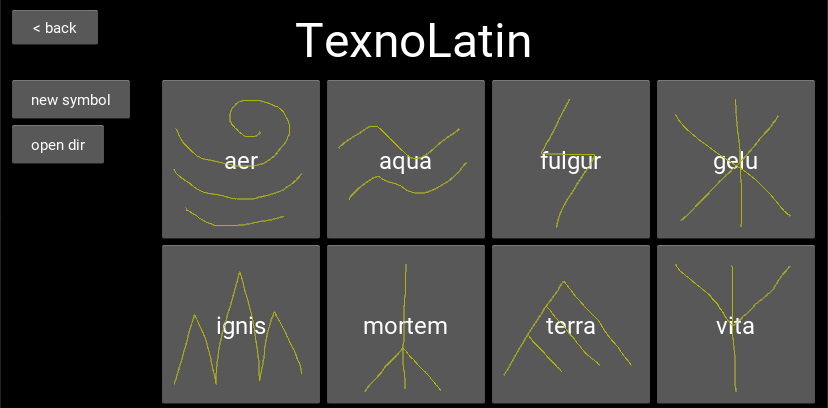

# Words of Power Editor

**Words of Power Editor** is a free open source app for creation,
modification, distribution, and machine recognition of custom magic
symbols in **TexnoMagic** format used in upcoming
[texnoforge](https://texnoforge.dev)
game
[Words of Power](https://texnoforge.dev/pages/words-of-power.html)
and any other games/apps that choose to adopt this free format and/or tool.

The goal is to provide users with means to create and share their own custom
symbols by drawing them with mouse or any other pointing device. After
collecting enough drawings of a symbol, a model can be trained and used to
recognize the symbol from user input.

Entire alphabets of symbols with names, meanings, and graphical
representations can be created including models to recognize individual
symbols drawn by users in real-time.


## Status

### first pre-alpha preview release 0.0.1 is here 🎉

You can already use `wopeditor` to:

* create and save new magic symbols and alphabets
* draw multiple drawings of a symbol using mouse or other pointing device
* view and download community alphabets as mods from [mod.io]
* export alphabets as single .zip file you can upload to [mod.io]

[mod.io]: https://wop.mod.io/

Even though there isn't any recognition functionality yet, `wopeditor` can be
used to create, modify, store, and share magic symbols in **TexnoMagic** format.

With core features complete, it's time for some science ⊂(✰‿✰)つ

**teaser screenshot:**




## TexnoMagic

I created **TexnoMagic** format after prototyping serveral systems for magic
symbol recognition and invocation as well as systems for creating magic
language based on symbols. You can read my posts about
[Theory of Magic](https://texnoforge.dev/words-of-power-devlog-1-theory-of-magic.html) and
[Invocation of Magic](https://texnoforge.dev/words-of-power-devlog-2-invocation-of-magic.html)
to get better idea of what I'm trying to achieve.

`wopeditor.texnomagic` module is dedicated to technical side of things and I
plan to make it a dedicated module available from PyPI once it matures but
for now it's more convenient to have everything in one repository.

`texnomagic` is going to use [SciPy](https://www.scipy.org/) python
scientific package to train symbol models using GMMs and recognize symbols
using these models. I've already prototyped this and confirmed it works, this
is an attempt at serious implementation which can be reused in other software
and/or used as a reference.


## Requirements Installation

You should be ablo to run `wopeditor` on many different systems supported by
Kivy framework including Linux, Windows, Mac, and Android.

You need to install following requirements:

* [Python 3](https://www.python.org/downloads/) - developed and tested with
  **Python 3.9** (lower versions might or might not work)

* [Kivy](https://kivy.org/doc/stable/gettingstarted/installation.html)
  UI framework - you **need version 2.0.0 or newer**

**tl;dr** install Python 3 which includes `pip` and then:

```
pip install kivy
```


## Usage

After you've installed requirements above, run following in `wopeditor` top dir:


### on any system

```
python wopeditor.py
```

### on linux/unix

```
./wopeditor.py
```

### on windows

```
wopeditor.bat
```

## Bugs and Feature Requests

Please use [GitHub Issues](https://github.com/texnoforge/wopeditor/issues)
to report any problems or feature requests.

Contributions, suggestions, and ideas are always welcome!


## Current Features

### UI

* create new alphabets and symbols
* draw symbols using mouse and save to files
* browse and preview symbols loaded from disk
* easily open relevant files in file manager

### mods

* show and download mods from [mod.io]
* export symbols/alphabets to zip files/[mod.io]

### code

* code is split into small files arranged in a sustainable modular structure including UI
* clean reusable UI code for loading and displaying alphabets/symbols/drawings from disk
* separate `wopeditor.texnomagic` module to easily interface and work with
  symbol/alphabet data on disk - logic separate from UI
* `wopeditor` module can be imported locally but it's also ready be packaged using
  `setuptools` for PyPI, using `PyInstaller` for Windows, and using native
  packaging tools for linux distros


## Planned Features

* train models from saved symbol drawings
* recognize symbols from drawings using models
* export alphabets/symbols as mods
* online mod browser integration
* **more**


## Contact

Feel free to drop by
[#wopeditor @ texnoforge discord](https://discord.gg/Dq3vaeg3pG).
