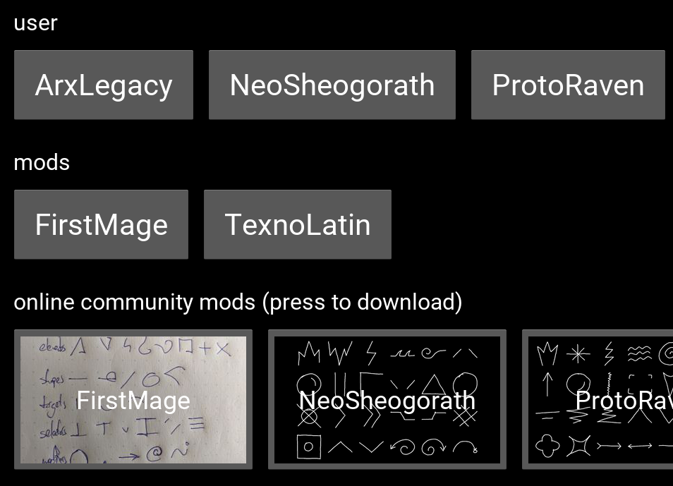

# [python-wopeditor docs on GitHub][docs]

## wopeditor docs offline

See docs/README.md and other files in docs/ directory.

You can also render docs into HTML using mkdocs:

    pip install mkdocs
    mkdocs build
    browser site/index.html

#### read the [docs] and have a nice magic ᕕ( ᐛ )ᕗ

[docs]: https://github.com/texnoforge/python-wopeditor/tree/master/docs
